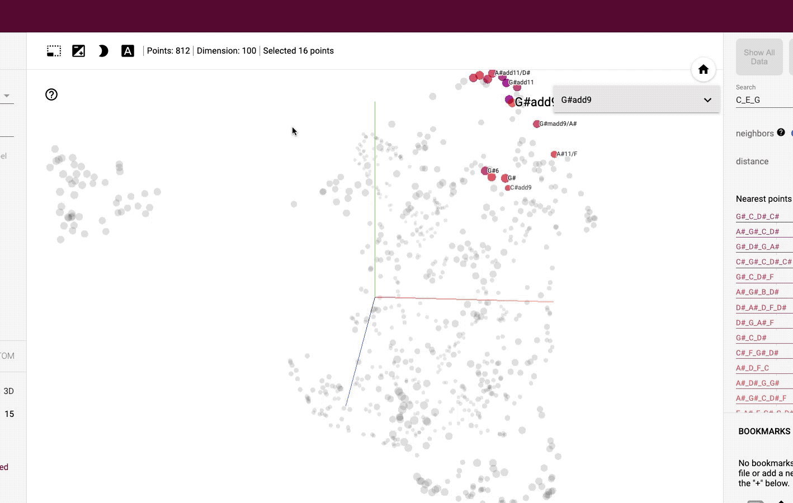

# NLP MIDI

NLP tools for generative MIDI music.



## Installation

Install `tonegraph` dependency as pip package

```
git clone https://github.com/omardelarosa/tonegraph.git
cd tonegraph
pip install -e .
```

## CLI

### Running a MIDI server

```bash
python cli.py \
    --mode midi \
    --modelIn models/jazz_progressions-12d.mdl.fasttext \
    --inPort 'VMini Out' \
    --outPort 'IAC Driver IAC - Bus 1'
```

### Help

```
usage: cli.py [-h] [--mode MODE] [--corpusPath CORPUSPATH] [--modelIn MODELIN]
              [--inPort INPORT] [--outPort OUTPORT]

MIDI chord expansions using language models.

optional arguments:
  -h, --help            show this help message and exit
  --mode MODE           supported modes: ['printPorts', 'midi', 'train']
  --corpusPath CORPUSPATH
                        path to training corpus
  --modelIn MODELIN     language embedding model used for input
  --inPort INPORT       midi input port name
  --outPort OUTPORT     midi output port name
```
